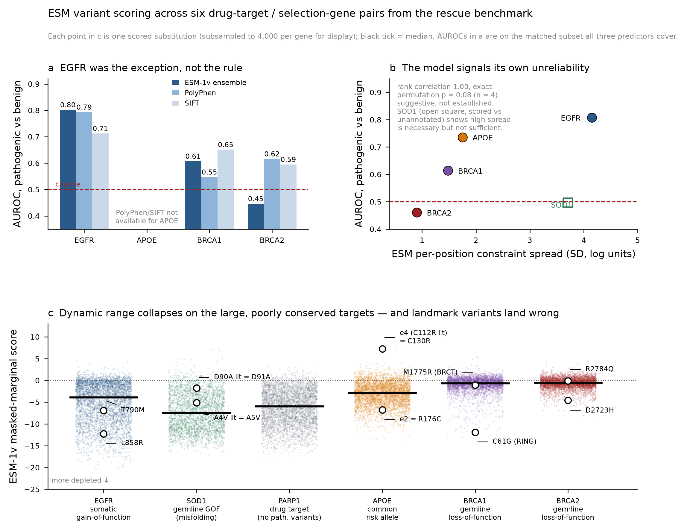

# Module 2 — protein-variant plausibility with ESM, and when not to trust it

**Headline: on the six selection genes scored so far, an ESM-1v masked-marginal score is a usable
residue-level triage signal on two and no better than a classical predictor on the rest.** EGFR,
the gene this module was originally built against, is the exception rather than the rule. Every
case therefore emits `applicability.verdict`, decided by measured performance, which a consumer is
expected to read before the scores.

## What the score is

For each position the residue is masked and the model predicts what belongs there from the rest of
the sequence. The score is the log-ratio of variant to wild type:

    score(i, mut) = log p(x_i = mut | x_-i) − log p(x_i = wt | x_-i)

Nothing about drugs, patients or disease enters — the model saw only unlabelled protein sequences.
Protocol: masked marginals, Meier et al. 2021 (NeurIPS). Primary score is the mean over the five
independently-trained ESM-1v checkpoints; their disagreement is retained per variant as a free
uncertainty estimate.

## Results

AUROC for ClinVar pathogenic/likely-pathogenic vs benign/likely-benign, retrieved independently
from the EBI Proteins API. The matched-subset columns are the like-for-like comparison on variants
all three predictors cover, and they are what the verdict uses. They are **not** the same as the
overall AUROC, which is computed on every variant ESM scores: for EGFR the matched subset is 0.802
on 93 pathogenic / 505 benign while the overall figure is 0.808 on 108 / 519. Quote the matched
column when comparing predictors and the overall figure only on its own.

| Selection gene | Drug | Mechanism | ESM (matched) | PolyPhen | SIFT | Verdict |
|---|---|---|---|---|---|---|
| EGFR  | gefitinib    | somatic gain-of-function        | **0.802** | 0.793 | 0.712 | rank_residues_only |
| APOE  | bapineuzumab | common risk allele              | 0.736 (overall; no PolyPhen/SIFT coverage) | — | — | rank_residues_only |
| BRCA1 | olaparib     | germline loss-of-function       | 0.607 | 0.547 | **0.651** | do_not_rank |
| BRCA2 | olaparib     | germline loss-of-function       | 0.446 | **0.616** | 0.595 | do_not_rank |
| SOD1  | tofersen     | germline GOF (misfolding)       | not measurable (2 benign exist) | — | — | not_validated |
| PARP1 | olaparib     | drug target, no pathogenic variants | not measurable | — | — | not_validated |

Three findings matter more than the table.

**BRCA2 is below chance (0.461 overall).** On the largest and best-annotated set in the study —
1,233 pathogenic against 5,936 benign — PolyPhen reaches 0.616 and ESM does worse than a coin
flip. This is not a pipeline bug: established pathogenic variants score sanely where they should
(BRCA2 D2723H at the 1.4th percentile, BRCA1 C61G in the RING domain at 0.1). The cause is visible
in the score distributions: BRCA2's median score is −0.53 where EGFR's kinase domain reached −17,
so the model assigns almost no constraint anywhere in a large, poorly conserved protein. Pathogenic
BRCA2 R2784Q lands at −0.09, indistinguishable from wild type.

**APOE ε4 scores +7.28, the 100th percentile** — the model prefers it to the wild-type cysteine. ε4
is the strongest common genetic risk factor in Alzheimer disease and ClinVar classifies it
pathogenic. The model is not malfunctioning: ε4 is the ancestral mammalian residue, so it is
evolutionarily unremarkable while being disease-relevant over modern human lifespans. Any pipeline
that used sequence plausibility to screen a stratification marker would have rejected
bapineuzumab's biomarker for a reason that does not generalise.

**SOD1 sits at 0.497 against unannotated variants** — exactly chance, with the pathogenic median
(−7.35) indistinguishable from background (−7.48). Canonical ALS variants scatter across the whole
range: H46R at the 8th percentile, A4V — the most aggressive — at the 66th, D90A at the 88th.
SOD1-ALS is a misfolding/aggregation gain-of-function, which leaves evolutionary constraint intact.
Note that SOD1 has *high* constraint spread and still fails, so spread is necessary but not
sufficient.

## The signal is positional, not substitution-specific

Splitting each score into a per-position mean (residue constraint) and a substitution-specific
residual:

| Selection gene | Full score | Position mean alone | Substitution residual |
|---|---|---|---|
| EGFR  | 0.808 | 0.798 | 0.463 |
| BRCA1 | 0.614 | **0.700** | 0.390 |
| BRCA2 | 0.461 | 0.537 | 0.410 |

The residual is at or below chance everywhere, and on BRCA1 discarding substitution identity
entirely *improves* discrimination (0.700 vs 0.614). ESM can indicate that a residue is
constrained; it cannot reliably say which substitution at that residue is the damaging one. A test
asserts this rather than only documenting it (`test_substitution_residual_is_at_or_below_chance_everywhere`).

## Generalizations that made the new cases expressible

**Selection gene ≠ drug target.** `target_id` keeps its original meaning (the drug target, so
module 4's chemistry handoff is unchanged) and `selection_gene_id` says where the variants live.
Four relationships are in use: `same_protein_drug_target` (gefitinib/EGFR), `synthetic_lethality`
(olaparib — variants in BRCA1/BRCA2, drug target PARP1), `same_gene_antisense` (tofersen/SOD1),
`stratification_marker_only` (bapineuzumab — APOE ε4, where the drug targets amyloid-beta).

For the synthetic-lethality case the two branches describe different proteins and **cannot be
joined at the variant level at all**: across 209 PARP1 assays none carries a variant annotation,
whereas EGFR assays annotate the mutation on the assay record via ChEMBL's `variant_sequence`
field (16 of afatinib's 60 analogs have mutant-genotype data).

**Any protein length.** The hand-declared 1022-residue window is gone. Proteins under the ESM-1v
positional limit are scored whole with no truncation (SOD1 154 aa, APOE 317 aa, PARP1 1014 aa);
longer ones are covered by overlapping tiles with each position scored in the tile where it sits
most interior (EGFR 2, BRCA1 3, BRCA2 5). The tiling artifact was measured rather than assumed: on
BRCA2, 300 overlap positions re-scored in a second tile gave a median mean absolute delta of 0.18
log units, p95 0.58, with 2.3% of positions above 1.0 — small against a score range spanning ~25
log units.

**Per-gene numbering verification.** Literature nomenclature does not agree with UniProt precursor
numbering for every gene, and a silent offset would invalidate every downstream score:

| Gene | Offset | Example |
|---|---|---|
| SOD1  | **+1**  | canonical A4V is position 5 (initiator Met cleaved) |
| APOE  | **+18** | ε4's C112R is position 130 (signal peptide 1–18) |
| BRCA1, BRCA2, EGFR | 0 | C61G, D2723H, L858R as written |

Each case carries explicit assertions checked against the actual residue; `verify_numbering`
raises rather than warns.

## A diagnostic that is *not* used as a rule

ESM's own per-position constraint spread ranks the four evaluable genes in exactly AUROC order
(EGFR 4.15 → 0.808, APOE 1.75 → 0.736, BRCA1 1.48 → 0.614, BRCA2 0.91 → 0.461; rank correlation
1.00). That is attractive as a pre-flight check, but the exact permutation p-value is **0.083 with
n = 4** and SOD1 contradicts it. It is recorded in `validation.reliability_diagnostic` as
suggestive and explicitly excluded from the verdict rule.

## Reproducing

    make module2-gefitinib      # or -olaparib, -olaparib-brca1, -tofersen, -bapineuzumab

runs offline from the committed tables in `data/module2` — no network, no GPU — and writes
`outputs/module2/module2_output.json` validated against `schemas/module2_output.schema.json`.

Re-scoring from scratch needs a GPU; the runs behind the committed tables were executed on Modal
A10G sandboxes, one per model shard (~95 s for SOD1 up to ~720 s for BRCA2):

    python scripts/score_module2_case.py --gene BRCA2 --uniprot P51587 \
        --case-id CASE-BRCA2-OLA-OV-005 --drug olaparib --drug-target PARP1 \
        --relationship synthetic_lethality --overlap-qc \
        --check "D2723H:2723:D" --check "R3052W:3052:R"

## Limitations

- **Single-residue substitutions only.** In-frame deletions and insertions — including EGFR exon-19
  deletions and exon-20 insertions, a large share of clinically actionable EGFR alterations —
  nonsense/stop and splice variants are not scored and are absent from the output. Absence is not
  evidence of tolerance. This also puts ataluren (nonsense-readthrough in DMD) out of scope.
- **ClinVar is not a fully independent benchmark.** ACMG interpretation formally admits
  computational evidence, so the reported discrimination is likely optimistic. Restricting to
  variants with submitted review criteria left EGFR essentially unchanged (0.806), so the
  circularity is structural rather than an artifact of weak submissions.
- **Scores are log-probability ratios.** Never average them with pChEMBL values, germline burden
  scores from module 3, or any other model output.
- **No efficacy claim** follows from structural similarity to the reference drug, and none from a
  variant's score. ESM cannot infer the direction of a functional effect.
- This is research tooling for hypothesis generation, not clinical variant interpretation.
